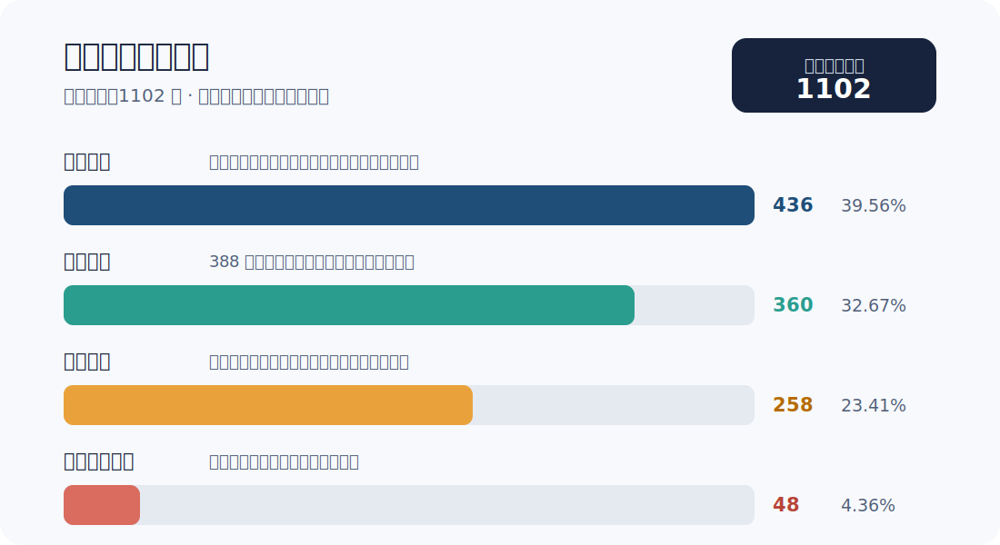

# 训练数据构建报告（决赛最终版）

版本：2026-07-16

训练快照：1102 条

评估集：Benchmark v5，内容版本 5.2，304 题

## 先说结论

本项目没有把模型输出直接当作训练真值。新批次采用“项目作者准备候选—第一模型预标注—第二模型复核—项目作者终审”的责任链，最终再执行配对、重复、索引和 train/test 泄漏检查。

训练集由 436 条混合截图、258 条代码渲染图、360 条人工筛选样本和 48 条人工转写样本组成，共 1102 条。436 条混合截图来自联网采集的合规公开开发截图及项目作者手动截图；258 条为代码、配置、命令和日志的本地渲染图。四部分来源和处理方式分开记录，不混写。

## 训练数据规模与来源

| 批次 | 数量 | 图片来源与构建方式 | 进入训练集的条件 |
| --- | ---: | --- | --- |
| 历史混合截图 | 436 | 联网采集的合规公开 IDE、终端、开发工具和文档截图，经裁切、重排、压缩或拍屏等二次加工；另含项目作者手动截取的开发场景 | 图片/TXT 配对、文字可辨、开发场景主体明确，并通过人工文本检查 |
| 代码渲染图 | 258 | 将代码、配置、命令、日志和文档片段在本地渲染为 VS Code、JetBrains、终端或文档风格图片 | 源文本生成初始真值；渲染和增强后重新检查符号、换行与裁切 |
| 2026-06-18 人工筛选批次 | 360 | 从 388 张自采、公开可访问开发页面截图和困难增强候选中筛选 | 模型分类用于分组；人工剔除 28 张错类、质量差或价值不足候选；合入前重复与泄漏检查为 0 |
| 人工转写补充批次 | 48 | 从 100 张受研究用途许可约束的 IDE 截图候选中选取；93 张完成人工转写，再筛出 48 张 | 逐图转写、人工筛选、配对与泄漏检查通过；原始素材不随模型或仓库重新分发 |
| 合计 | 1102 | `train.json` 与 1102 张图片、1102 份 TXT 对齐 | 阻塞问题 0 |

四类来源占比分别为混合截图 39.56%、人工筛选 32.67%、代码渲染 23.41% 和人工转写补充 4.36%。这张图只描述训练来源，不把渲染或增强方式当作场景类别。

联网采集对象是公开可访问的开发界面、开源项目页面和技术文档截图。采集后只保留开发文本相关区域，并进行裁切、主题变化、压缩或拍屏等二次加工。所有公开截图按其公开页面和许可边界使用；第三方素材不随仓库或模型重新分发，也不因模型发布而被重新授权。

## 场景与视觉覆盖

训练目标覆盖代码编辑器主体、终端与命令行、Traceback 和诊断日志、YAML/JSON/TOML 等配置、Git diff、文档代码块、API 表格及多区域开发工具界面。视觉变化包括：

- VS Code、JetBrains、终端和网页文档的明暗主题；
- 小字号、长行、符号密集、深层缩进和多语言代码；
- JPEG 压缩、模糊、低光、透视、拍屏、反光和摩尔纹；
- 文件名、标签页、正文、终端和提示框同时出现的多区域画面。

增强只改变成像条件，不得改变可见文字。若裁切使字符不可见，真值必须同步删除相应内容，不能保留画面外的源文本。

## 标注人员与职责

| 环节 | 责任主体 | 工作内容 | 权限边界 |
| --- | --- | --- | --- |
| 候选准备 | 项目作者 | 收集、手动截图或生成图片，记录批次和来源，排除隐私、无关或许可不清内容 | 未检查候选不得直接并入训练集 |
| 第一遍预标注 | 第一 OCR/VLM 模型 | 在适用的新批次生成可见文字草稿，减少机械转写工作 | 不拥有最终真值决定权 |
| 第二遍复核 | 第二模型 | 对照图片和草稿，指出漏行、错符号、顺序及结构差异 | 不直接覆盖最终 TXT，不补全不可见内容 |
| 最终终审 | 项目作者 | 回到原图逐行核对，修订 TXT，决定通过、返工或弃用 | 不依据代码语义猜测遮挡内容 |
| 机械审计 | 脚本 | 检查配对、空标注、索引、重复和 train/test 哈希重叠 | 不替代人工视觉检查 |

训练集的新建或重标批次按上述责任链执行。评估集 304 题则全部采用同等强度的“第一模型预标注—第二模型复核—项目作者终审”流程；早期批次即使没有逐项保留原始模型响应，也已重新完成两遍模型检查和人工终审，不能仅按 `legacy_frozen` 状态理解为未经复核。

## 预标注、复核与终审流程

1. 项目作者准备候选图片，并记录来源类型、批次和使用边界。
2. 第一模型输出 OCR 草稿；代码渲染样本以渲染源文本作为草稿起点。
3. 第二模型只给出差异意见，重点检查主体遗漏、符号、缩进、换行、表格层级和阅读顺序。
4. 项目作者对照原图逐行核验，修订同名 TXT，并作出“通过、返工、弃用”决定。
5. 最终 TXT 只记录图片中可见文字，不解释代码，不改写为等价实现，不补全遮挡或画外内容。
6. 合入时把图片与 TXT 写入隔离批次目录，再更新 `train.json`；合入前保留索引回滚点。

模型分类与 OCR 真值相互独立。分类模型只帮助把候选分到 IDE、终端、日志、配置等场景，不能直接生成或修改转写真值。

## 质量控制与合入门槛

### 人工检查

- 图片主体属于开发场景，文字达到可标注程度。
- 大小写、括号、引号、冒号、点号、路径分隔符和命令参数逐项核对。
- 保留有意义的缩进、换行、表格结构和多区域阅读顺序。
- 错配、来源不清、隐私风险、重复、不可读或只含装饰 UI 的候选直接弃用。

### 机械检查

- 图片与 TXT 同名配对，空 TXT 为 0。
- `train.json` 引用图片全部存在，未索引图片为 0。
- 批内和训练集图片 SHA-256 重复组为 0。
- 训练图片与当前 304 题评估集图片 SHA-256 重叠为 0。
- 合入前后记录数量和回滚点，避免部分复制或索引漂移。

公开仓库提供 `dataset/audit_dataset_quality.py` 作为基础质检入口：

    python -B .\dataset\audit_dataset_quality.py <candidate-folder> --output <audit.tsv>

## 测试数据的来源、标注和隔离

决赛使用 Benchmark v5、内容版本 5.2，共 304 题。测试集不参与训练、继续微调或训练期提示词搜索。

| 测试集组成 | 数量 | 来源与处理 |
| --- | ---: | --- |
| 历史评估池截图 | 149 | 来自既有评估池，包含实际 IDE、终端、浏览器文档、日志、配置、diff 和多区域开发界面截图；早期来源以批次级记录为主，重新执行双模型复核、人工终审、分类、难度和哈希审计 |
| 公开开发网页截图 | 55 | 从公开可访问的 GitHub 页面和技术文档中截取真实开发内容区域；逐图核对可见文字、结构和阅读顺序 |
| 自写内容本地渲染图 | 70 | 自写代码、配置、命令、日志和表格在本地开发界面中渲染，用于补齐结构和困难场景；不冒充真实拍摄 |
| 真实手机拍屏 | 9 | 项目作者实际拍摄屏幕，覆盖低光、透视、反光、摩尔纹和拍摄噪声 |
| AIGC 拍屏参考图 | 14 | 参考开发场景制作的受控拍屏困难图，单独标记来源，不冒充真实拍摄 |
| AIGC 编辑图 | 7 | 对开发屏幕画面施加受控拍屏或视觉退化编辑，保留独立来源记录 |
| 合计 | 304 | 图片、逐图 TXT、`test.jsonl` 和 `manifest.jsonl` 同步冻结 |

按来源计算，非 AIGC 样本为 283/304（93.09%）。真实画面不只包括新增的 9 张手机拍屏：历史评估池和 55 张公开开发网页截图中还包含大量直接截取的 IDE、终端和浏览器开发界面。由于 149 张历史样本的早期来源以批次级记录为主，本报告不虚构其精确的真实截图子计数；70 张本地渲染图与 21 张 AIGC 参考/编辑图均单独标明，不混写为真实拍摄。

304 题全部执行第一模型预标注、第二模型复核和项目作者终审。新增 30 题的逐项终审记录完整保留，30/30 已批准；历史 274 题也按相同检查重点重新复核，覆盖漏行、错符号、缩进、结构和阅读顺序。类别与难度由人工根据图片内容重新判断，新 30 题不继承被替换样本的槽位。

当前类别分布为 P01 75、P02 35、P03 36、P04 31、P05 20、P06 33、P07 24、P08 20、P09 30；难度分布为 simple 63、medium 156、hard 85。冻结后若修改图片、真值或 manifest，必须创建新内容版本并完整重跑 304 题。

## 当前审计结果

| 检查 | 结果 |
| --- | ---: |
| 训练索引 / 实际图片 | 1102 / 1102 |
| 评估样本 / 唯一 ID | 304 / 304 |
| 训练未索引图片 | 0 |
| 训练图片哈希重复组 | 0 |
| 训练与评估图片 SHA-256 重叠 | 0 |
| 评估集同等强度复核与人工终审 | 304/304 通过 |
| 冻结审计阻塞问题 | 0 |

## 同口径基线对比

下面只比较 Benchmark v5 内容版本 5.2、短提示词 `<image>OCR:` 和同一 `tencent/hy3:free` 非思考裁判口径。模型 v6 使用本地 vLLM，官方版使用 PaddleOCR-VL-1.6 官方 API；因此该表证明的是最终方案在实际统一评测口径下的提升，不把全部差值简单归因于 LoRA 训练。

| 指标 | PaddleOCR-VL-1.6 官方 API | 本地微调模型 v6 | 差值 |
| --- | ---: | ---: | ---: |
| 有效记录 | 303/304 | 304/304 | +1 |
| 最终积分 | 40.1408 | **58.4427** | **+18.3019** |
| 类别加权分 | 63.8491 | **72.8633** | **+9.0142** |
| 全局样本均值 | 62.3878 | **73.3494** | **+10.9616** |
| 严格可用率 | 25.6579% | **38.1579%** | **+12.5000 个百分点** |
| 完成率 | 98.0263% | **99.0132%** | **+0.9869 个百分点** |
| 安全分 | 80.2632% | **90.7895%** | **+10.5263 个百分点** |
| 平均 NED（越低越好） | 0.2660 | **0.1744** | **-0.0916** |

## 已知限制

- 历史混合截图的样本级来源记录粒度低于后续批次，但其来源均为合规公开截图或项目作者手动截图，并经过二次加工和人工检查。
- 训练数据不公开；外部复现侧重公开脚本、批次规模、处理流程和审计结果，不重新分发原图。
- 受研究用途许可约束的第三方图片不随仓库或模型发布；商业使用前需要重新评估许可边界。
- 模型辅助标注能降低机械工作量，但无法替代人工终审，特别是小字号、拍屏和多区域样本。
